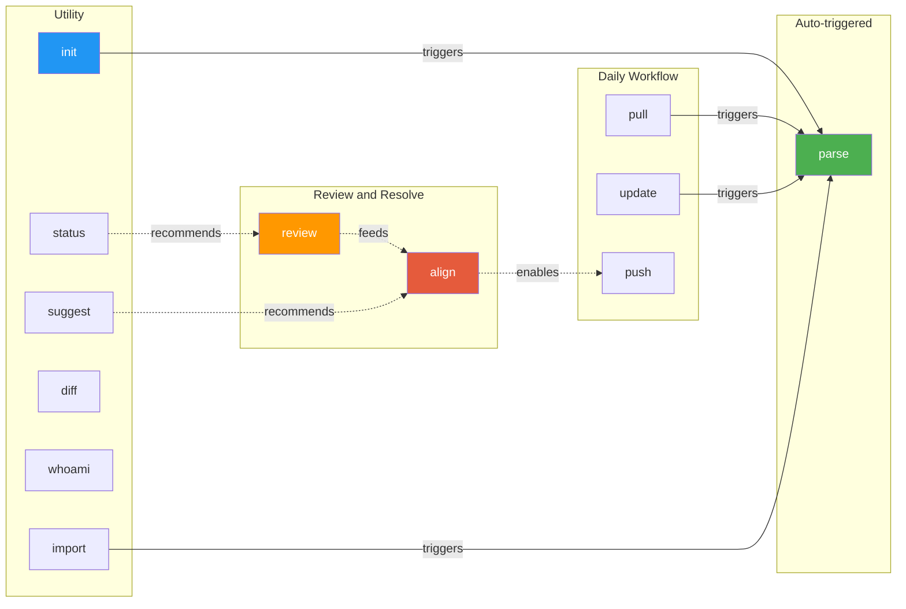

# PhoenixTeam

Distributed AI team document collaboration plugin �?pure prompts, zero code, ready to use immediately.

> 中文文档: [README.zh-CN.md](./README.zh-CN.md)

## Overview

PhoenixTeam implements collaboration as pure Prompt Skills, letting AI coding tools (Claude Code, Codex CLI) act as a "collaboration plugin" that manages design documents across a multi-person AI team. All operations are triggered by natural language commands �?AI automatically calls Git, reads/writes files, and parses documents. No code required.

## Installation

### Claude Code �?`.claude/commands/` (recommended)

```bash
git clone https://github.com/surebeli/PhoenixTeam.git /tmp/phoenix-team

# Install to current project
mkdir -p .claude/commands
for skill in /tmp/phoenix-team/plugin/skills/*/SKILL.md; do
  cp "$skill" ".claude/commands/$(basename $(dirname $skill)).md"
done

# Or install globally (applies to all projects)
mkdir -p ~/.claude/commands
for skill in /tmp/phoenix-team/plugin/skills/*/SKILL.md; do
  cp "$skill" ~/.claude/commands/$(basename $(dirname $skill)).md
done
```

### Claude Code �?`/plugin` marketplace

```bash
/plugin marketplace add surebeli/PhoenixTeam
/plugin install p-team@PhoenixTeam
```

### Codex CLI

```bash
git clone https://github.com/surebeli/PhoenixTeam.git ~/.codex/skills/phoenix-team
```

### Any AI tool �?standalone prompt

Copy `PHOENIXTEAM.md` to your project root, then tell your AI tool:

```
You are now the PhoenixTeam Plugin. Follow all rules in ./PHOENIXTEAM.md strictly.
Skill: init
```

## Quick Start

### Quickstart Demo (Try it locally)
We provide a mock scenario to let you experience the PhoenixTeam conflict resolution workflow in 1 minute.

```bash
# 1. Clone the repo and install skills (see Installation above)
git clone https://github.com/surebeli/PhoenixTeam.git
cd PhoenixTeam

# 2. Run init and provide the mock data directories when prompted
# When asked for document directories, enter: ./tests/mock-scenarios/demo-1-conflict/alice, ./tests/mock-scenarios/demo-1-conflict/bob
/phoenix-init

# 3. Detect divergences between alice (REST) and bob (GraphQL)
/phoenix-review

# 4. Resolve the detected conflict (e.g. D-001)
/phoenix-align D-001
```

### TL;DR

```
Daily workflow:    pull �?(update) �?push
When diverging:    review �?align
Not sure:          status or suggest
```

### Core Workflow

```
                        ┌─────────────────────────────────�?
                        �?    First time (one-time)       �?
                        �?       /phoenix-init            �?
                        �?  Create .phoenix/, bind ID,    �?
                        �?  set THESIS, normalize docs    �?
                        └──────────────┬──────────────────�?
                                       �?
                  ┌────────────────────────────────────────�?
                  �?         Daily Collaboration Loop      �?
                  �?                                       �?
   ┌──────────────▼───────────────�?                       �?
   �? /phoenix-pull               �?                       �?
   �? Pull remote + auto parse    �?                       �?
   └──────────────┬───────────────�?                       �?
                  �?                                       �?
                  �?                                       �?
        ┌─── Source docs changed locally?                  �?
        �?                                                 �?
       YES                  NO                             �?
        �?                   �?                            �?
        �?                   �?                            �?
   /phoenix-update           �?                            �?
   Sync to .phoenix/         �?                            �?
   (auto parse)              �?                            �?
        �?                   �?                            �?
        └────────┬───────────�?                            �?
                 �?                                        �?
                 �?                                        �?
        ┌─── Divergences between collaborators?            �?
        �?                                                 �?
       YES                  NO                             �?
        �?                   �?                            �?
        �?                   �?                            �?
   /phoenix-review           �?                            �?
   Detect �?DIVERGENCES.md   �?                            �?
        �?                   �?                            �?
        �?                   �?                            �?
   /phoenix-align            �?                            �?
   Propose �?Approve         �?                            �?
        �?                   �?                            �?
        └────────┬───────────�?                            �?
                 �?                                        �?
                 �?                                        �?
          /phoenix-push                                    �?
          Commit + push to remote                          �?
                 �?                                        �?
                 └─────────────────────────────────────────�?
```

### Core Skills (7)

| Skill | Role | When to use |
|-------|------|-------------|
| **init** | Create workspace, bind identity, set THESIS | First time / new member joining |
| **pull** | Pull remote + diff analysis by collaborator | Before starting work |
| **update** | Sync local source docs �?`.phoenix/design/{me}/` | After editing source documents |
| **parse** | Scan docs �?generate INDEX.md | *Usually auto-triggered* by pull/update/init |
| **review** | Compare proposals �?generate DIVERGENCES.md | After multiple collaborators updated proposals |
| **align** | Two-phase resolution: Propose �?Approve | After review finds divergences |
| **push** | Diff review + divergence gate + push | Ready to share changes |

### Auxiliary Skills (5)

**`/phoenix-status`** �?Full dashboard

> When: Morning check-in, returning after a few days, quick overview of pending approvals.
> Shows: identity, collaborator map, divergence panel, recent diffs, blockers, consistency score (0-100).

**`/phoenix-diff`** �?Precise diff inspection

> When: Need to inspect a specific range beyond what pull/parse auto-shows.
> Params: `--last` (unpushed changes), `--commit=abc123` (specific commit), `--against=origin/main` (all local vs remote).

**`/phoenix-suggest`** �?AI collaboration suggestions

> When: Unsure what to do next; want AI to prioritize based on actual diffs and divergence state.
> Ranks: pending approvals > pending action items > open blockers > diff insights.

**`/phoenix-whoami`** �?Identity binding

> When: New clone, switching machines, multi-device collaboration.
> Identity is stored in `.git/config` (machine-local), so each device needs binding.

**`/phoenix-archive`** �?Freeze a proposal

> When: A design proposal is superseded or rejected after alignment.
> Moves to `.phoenix/archive/{date}/`, warns if file is referenced in unresolved divergences.

## Skill Reference

| Command | Function | Parameters |
|---------|----------|------------|
| `/phoenix-init` | Initialize (founder sets goal �?others confirm and join) | Interactive |
| `/phoenix-whoami` | View/bind machine identity (multi-machine support) | Interactive |
| `/phoenix-pull` | Pull + parse + diff summary | �?|
| `/phoenix-push` | Push (diff check + unresolved divergence soft gate + source drift) | Optional commit message |
| `/phoenix-parse` | Scan documents, generate INDEX.md | �?|
| `/phoenix-status` | Global status + divergence panel + consistency score (0-100) | �?|
| `/phoenix-suggest` | Diff-based collaboration suggestions | Optional question |
| `/phoenix-diff` | Diff details (grouped by collaborator) | `--last` / `--commit=<hash>` / `--against=origin/main` |
| `/phoenix-review` | Divergence analysis, results written to DIVERGENCES.md (with commit anchors; skips collaborators with no new commits) | Optional focus topic |
| `/phoenix-align` | Two-phase divergence convergence: proposer submits (proposed), other confirms before taking effect (resolved) | `D-001` / keyword / `all` |
| `/phoenix-archive` | Proposal archive + decision freeze (checks divergence references before archiving) | `<code/filename>` |
| `/phoenix-update` | Source document incremental sync: hash-based change detection, divergence impact assessment, triggers parse | `--dry-run` / `--force` |

## Collaboration Flow

```
Alice (Claude Code)                    Bob (Codex CLI)
       �?                                    �?
 /phoenix-init (founder)              /phoenix-init (join)
 Set project goal �?THESIS.md         Review goal �?join
       �?                                    �?
 Edit .phoenix/design/alice/          Edit .phoenix/design/bob/
       �?                                    �?
 /phoenix-push ──────�?Git ◄───────── /phoenix-push
       �?                                    �?
 /phoenix-pull                        /phoenix-pull
       �?                                    �?
       └──────────── divergence found ───────�?
                          �?
                  /phoenix-review
                  Analyze docs vs THESIS �?generate D-001
                  Write DIVERGENCES.md + commit anchors
                          �?
  ┌───────────────────────┴────────────────────�?
  �?                                           �?
  Alice: /phoenix-align D-001                  �?
  Pick resolution �?proposed 🟡               �?
  ⚠️ THESIS not updated yet                    �?
  /phoenix-push                                �?
  �?                                           �?
  �?                             Bob: /phoenix-pull
  �?                             🟡 "D-001 awaiting your confirmation"
  �?                             Bob: /phoenix-align D-001
  �?                             �?Agree �?resolved
  �?                             Generate decisions/D-001.md
  �?                             Update THESIS Decision Log
  �?                             /phoenix-push
  �?                                           �?
  └────────────────────────────────────────────�?
                          �?
       ╔══════════════════╧══════════════════════════════════════════�?
       �? [Side flow] Apply decision to source documents              �?
       �?                                                             �?
       �? decisions/D-001.md contains per-party instruction blocks    �?
       �? (background / required changes / acceptance criterion)      �?
       �?                                                             �?
       �? Alice                            Bob                        �?
       �? Read decisions/D-001.md          Read decisions/D-001.md    �?
       �? Pass to own model �?             Pass to own model �?       �?
       �? Model edits source doc           Model edits source doc     �?
       �?      �?                               �?                    �?
       �? /phoenix-update                  /phoenix-update            �?
       �? AI verifies acceptance           AI verifies acceptance     �?
       �? criterion                        criterion                  �?
       �? �?Pass                           �?Pass                    �?
       �?      �?                               �?                    �?
       �?      └─────────── all �?─────────────�?                    �?
       �?                       �?                                    �?
       �?              D-001 fully-closed 🔒                          �?
       ╚══════════════════╤══════════════════════════════════════════�?
                          �?
              /phoenix-push (no open/proposed, push directly)
```


## Skill Dependency Graph



> **Legend**: Solid arrows = auto-triggers. Dotted arrows = workflow recommendations.

## Divergence Handling

### Four divergence states

| State | Meaning | Who can act |
|-------|---------|-------------|
| `open` 🔴 | Unresolved | Either party can propose |
| `proposed` 🟡 | One party proposed, awaiting other's confirmation | Other party confirms/rejects/modifies; proposer can withdraw |
| `resolved` �?| Both parties agreed, source documents being updated | Each party runs update to complete source doc updates |
| `fully-closed` 🔒 | All source documents updated per decision | Read-only, fully archived |

### DIVERGENCES.md �?Divergence registry

Written by `review`, read/written by `align`, read by `push`/`status`:

```markdown
## Open

### D-001: API style choice
Status: open 🔴 | Parties: alice vs bob | Priority: blocking

## Proposed

### D-002: Deployment strategy
Status: proposed 🟡 | Proposer: alice | Awaiting bob's confirmation
Proposed decision: adopt Kubernetes (bob's approach) | Reasoning: ...

## Resolved

### D-003: Data model �?
Status: resolved | Proposer: alice | Confirmer: bob
Decision: adopt NoSQL | Resolved at: 2026-04-09
Change instructions: See .phoenix/decisions/D-003.md
```

### Propose �?Approve two-phase confirmation

`align` automatically switches behavior based on divergence state:

- **Divergence is open** �?show comparison table + AI recommendation; user picks resolution �?status becomes `proposed`, THESIS **not updated yet**
- **Divergence is proposed, awaiting my confirmation** �?show proposer's resolution and reasoning:
  - �?Agree �?`resolved`; AI generates per-party change instruction blocks (with acceptance criteria); update THESIS Decision Log
  - �?Reject (with reason) �?revert to `open`
  - 🔄 Modify and counter-propose �?still `proposed`, proposer changes to me
- **Divergence is proposed, I am proposer** �?show waiting state; option to withdraw

### decisions/ �?Decision instruction files

When `align` confirms a resolution, it creates `.phoenix/decisions/D-{N}.md` containing:
- Full decision + reasoning
- Per-party change instruction blocks: what to change, in which file, and an **acceptance criterion** for automated verification by `update`

Users can pass `decisions/D-001.md` directly to their own model to execute source document changes.

### review commit anchor deduplication

`last-review.json` records each collaborator's commit hash at last analysis time:
- New commits �?re-analyze
- No new commits �?skip
- `resolved` / `proposed` �?not disrupted

### pull auto-alerts

After pulling: detects `proposed` divergences awaiting your confirmation, and `resolved` divergences with pending Action Items for you.

### push divergence soft gate

Before pushing, distinguishes:
- 🟡 Proposals awaiting my confirmation �?suggest confirming first
- 🔴 Unresolved divergences �?warn and wait
- �?Awaiting other party's confirmation �?inform (non-blocking)

## Source Document Sync

### Background

`init` does a one-time copy. If source documents (e.g. `./design/spec.md`) change afterward, the copies in `.phoenix/design/{code}/` are not automatically updated.

### phoenix-update solution

`update` records source file hashes in `last-sync.json`, detecting changes incrementally on each run:

```bash
/phoenix-update           # Detect and sync all changes
/phoenix-update --dry-run # Preview changes without writing
/phoenix-update --force   # Skip divergence confirmation, force sync
```

### Post-resolution source document updates (Action Items)

When `align` confirms a resolution, AI analyzes both parties' documents against the decision and generates Action Items written to `decisions/D-{N}.md`:

```markdown
## Source Document Action Items
| Collaborator | Source file | Required changes | Status |
|--------------|-------------|-----------------|--------|
| alice | ./design/api.md | Keep REST design unchanged | �?No changes needed |
| bob | ./design/api-proposal.md | Replace GraphQL with REST, update interface examples | �?Pending update |
```

After each party updates their source documents and runs `update`, AI auto-verifies against the **acceptance criterion**:
- �?Satisfied �?Action Item marked complete
- ⚠️ Not satisfied �?specific guidance (e.g. "GraphQL description still present in section 3")
- All complete �?divergence upgrades to `fully-closed` 🔒

### Branch protection

`init` records the current branch as the protected PhoenixTeam main branch (`git config phoenix.main-branch`). All other skills enforce a **branch guard** �?operations on any other branch are rejected:

```
�?Current branch 'feature-x' is not the PhoenixTeam main branch 'main'.
   Switch with: git checkout main
```

## .phoenix/ Directory Structure

Generated in the target project after initialization:

```
.phoenix/
├── COLLABORATORS.md    # Identity map: member codes �?doc directories; Main Branch metadata
├── THESIS.md           # Project design constitution (North Star) + Decision Log
├── RULES.md            # Code conventions
├── SIGNALS.md          # Runtime status & blockers
├── INDEX.md            # Auto-generated document index
├── DIVERGENCES.md      # Divergence registry (D-001�?status summary): written by review, read by align/push/status
├── last-parse.json     # Parse cache (file hashes)
├── last-review.json    # Review anchor: per-collaborator commit hashes + source file hashes at last review
├── last-sync.json      # Source document sync state: source file hashes, maintained by update skill
├── design/
�?  ├── alice/          # alice's normalized documents
�?  ├── bob/
�?  └── shared/         # Jointly maintained (optional)
├── decisions/          # Per-divergence decision files (created by align on resolution)
�?  ├── D-001.md        # Full decision + per-party change instruction blocks + acceptance criteria
�?  └── D-002.md
└── archive/            # Frozen proposals
```

## Repository Structure

```
PhoenixTeam/
├── .claude-plugin/
�?  ├── marketplace.json          # Marketplace manifest
�?  └── plugin.json               # Claude Code plugin definition
├── .codex-plugin/plugin.json     # Codex CLI plugin manifest
├── plugin/                       # Plugin core
�?  ├── skills/                   # 12 Skills (shared across platforms)
�?  �?  ├── phoenix-init/
�?  �?  ├── phoenix-whoami/
�?  �?  ├── phoenix-pull/
�?  �?  ├── phoenix-push/
�?  �?  ├── phoenix-update/
�?  �?  ├── phoenix-parse/
�?  �?  ├── phoenix-status/
�?  �?  ├── phoenix-suggest/
�?  �?  ├── phoenix-diff/
�?  �?  ├── phoenix-review/
�?  �?  ├── phoenix-align/
�?  �?  ├── phoenix-archive/
�?  �?  └── phoenix-import/
�?  ├── CLAUDE.md                 # Shared context (Claude Code)
�?  └── AGENTS.md                 # Shared context (Codex CLI)
├── PHOENIXTEAM.md                # Standalone prompt version (manual mode)
├── README.md                     # This file (English)
├── README.zh-CN.md               # Chinese translation
└── docs/design/                  # Example design documents
```


## License

MIT
