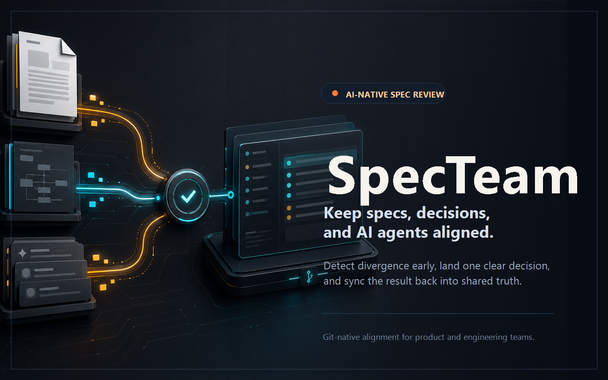
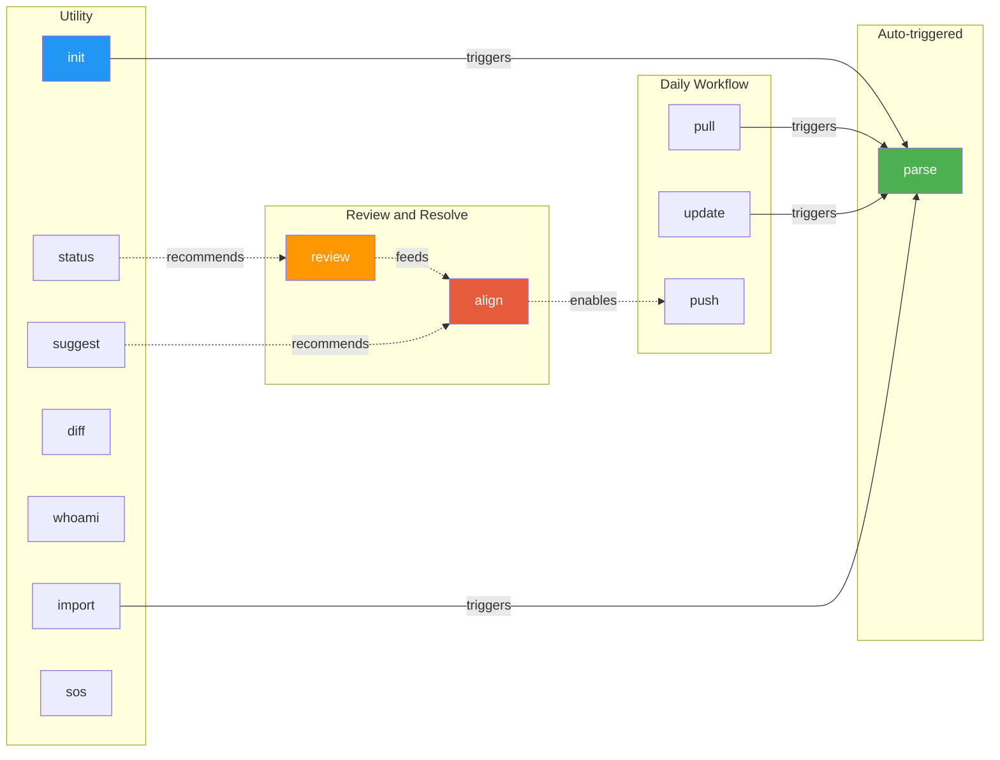

<p align="center">
  
</p>

# PhoenixTeam

Distributed AI team document collaboration plugin — pure prompts, zero code, ready to use immediately.

> 中文文档: [README.zh-CN.md](./README.zh-CN.md)

## Overview

PhoenixTeam implements collaboration as pure Prompt Skills, letting AI coding tools (Claude Code, Codex CLI) act as a "collaboration plugin" that manages design documents across a multi-person AI team. All operations are triggered by natural language commands — AI automatically calls Git, reads/writes files, and parses documents. No code required.

## Installation

### Claude Code — `.claude/commands/` (recommended)

```bash
git clone https://github.com/surebeli/PhoenixTeam.git /tmp/phoenix-team

# Install to current project
mkdir -p .claude/commands
for skill in /tmp/phoenix-team/plugin/skills/*/SKILL.md; do
  cp "$skill" ".claude/commands/$(basename $(dirname $skill)).md"
done

# Or install globally (applies to all projects)
mkdir -p ~/.claude/commands
for skill in /tmp/phoenix-team/plugin/skills/*/SKILL.md; do
  cp "$skill" ~/.claude/commands/$(basename $(dirname $skill)).md
done
```

### Claude Code — `/plugin` marketplace

```bash
/plugin marketplace add surebeli/PhoenixTeam
/plugin install p-team@PhoenixTeam
```

### Codex CLI

```bash
git clone https://github.com/surebeli/PhoenixTeam.git ~/.codex/skills/phoenix-team
```

### Any AI tool — standalone prompt

Copy `PHOENIXTEAM.md` to your project root, then tell your AI tool:

```
You are now the PhoenixTeam Plugin. Follow all rules in ./PHOENIXTEAM.md strictly.
Skill: init
```

## Quick Start

### 1-minute Demo (Local)
We provide a simulated scenario to let you experience PhoenixTeam's conflict detection and resolution in 1 minute.

```bash
# 1. Clone and install skills
git clone https://github.com/surebeli/PhoenixTeam.git
cd PhoenixTeam

# 2. Init and point to mock data
# When asked for document directories, enter: ./tests/mock-scenarios/demo-1-conflict/alice, ./tests/mock-scenarios/demo-1-conflict/bob
/phoenix-init

# 3. Detect conflicts between alice (REST) and bob (GraphQL)
/phoenix-review

# 4. Resolve a conflict (e.g., D-001)
/phoenix-align D-001
```

### Core Workflow

```
                        ┌─────────────────────────────────┐
                        │       First use (One-time)      │
                        │       /phoenix-init             │
                        │  Create .phoenix/, bind identity│
                        │  Write THESIS, normalize docs   │
                        └──────────────┬──────────────────┘
                                       │
                  ┌────────────────────────────────────────┐
                  │           Daily Collaboration          │
                  │                                        │
   ┌──────────────▼───────────────┐                       │
   │ /phoenix-pull               │                       │
   │ Pull remote + auto-parse    │                       │
   └──────────────┬───────────────┘                       │
                  │                                       │
   ┌──────────────▼───────────────┐                       │
   │ Edit source docs             │                       │
   │ (Human or AI edits code/doc) │                       │
   └──────────────┬───────────────┘                       │
                  │                                       │
   ┌──────────────▼───────────────┐                       │
   │ /phoenix-push               │                       │
   │ Sync to .phoenix/ + push    │                       │
   └──────────────┬───────────────┘                       │
                  │                                       │
                  └───────────────────┬───────────────────┘
                                      │
              ┌───────────────────────▼───────────────────────┐
              │           Conflict Resolution Flow            │
              │                                               │
              │ 1. /phoenix-review (Find divergences)         │
              │ 2. /phoenix-align (Propose/Approve decision)  │
              │ 3. /phoenix-update (Verify implementation)    │
              └───────────────────────────────────────────────┘
```

## Skill Reference

| Command | Description |
|---------|-------------|
| `/phoenix-init` | Initialize or join a project |
| `/phoenix-whoami` | Check or bind local identity |
| `/phoenix-pull` | Pull remote changes and auto-parse |
| `/phoenix-update` | Sync source documents to `.phoenix/` |
| `/phoenix-push` | Push changes to remote after divergence check |
| `/phoenix-review` | Analyze all docs for divergences vs THESIS |
| `/phoenix-align` | Resolve divergences via Propose → Approve |
| `/phoenix-status` | Comprehensive collaboration dashboard |
| `/phoenix-suggest` | AI-driven suggestions based on diffs |
| `/phoenix-diff` | View structured diff grouped by collaborator |
| `/phoenix-parse` | Scan documents and update `INDEX.md` |
| `/phoenix-archive` | Freeze and archive a design proposal |
| `/phoenix-import` | Import external docs via MCP/HTTP |
| `/phoenix-sos` | Emergency auto-resolution of Git merge conflicts in `.phoenix/` |

## Skill Dependency Graph



> **Legend**: Solid arrows = auto-triggers. Dotted arrows = workflow recommendations.

## Collaboration Flow

```
Alice (Claude Code)                    Bob (Codex CLI)
       │                                     │
 /phoenix-init (founder)              /phoenix-init (join)
 Set project goal → THESIS.md         Review goal → join
       │                                     │
 Edit .phoenix/design/alice/          Edit .phoenix/design/bob/
       │                                     │
 /phoenix-push ──────→ Git ◄───────── /phoenix-push
       │                                     │
 /phoenix-pull                        /phoenix-pull
       │                                     │
       └──────────── divergence found ───────→
                          │
                  /phoenix-review
                  Analyze docs vs THESIS → generate D-001
                  Write DIVERGENCES.md + commit anchors
                          │
  ┌───────────────────────┴────────────────────┐
  │                                            │
  Alice: /phoenix-align D-001                  │
  Pick resolution → proposed 🟡               │
  ⚠️ THESIS not updated yet                    │
  /phoenix-push                                │
  │                                            │
  │                             Bob: /phoenix-pull
  │                             🟡 "D-001 awaiting your confirmation"
  │                             Bob: /phoenix-align D-001
  │                             → Agree → resolved ✅
  │                             Generate decisions/D-001.md
  │                             Update THESIS Decision Log
  │                             /phoenix-push
  │                                            │
  └────────────────────────────────────────────┘
                          │
       ╔══════════════════╧══════════════════════════════════════════╗
       ║ [Side flow] Apply decision to source documents              ║
       ║                                                             ║
       ║ decisions/D-001.md contains per-party instruction blocks    ║
       ║ (background / required changes / acceptance criterion)      ║
       ║                                                             ║
       ║ Alice                            Bob                        ║
       ║ Read decisions/D-001.md          Read decisions/D-001.md    ║
       ║ Pass to own model →              Pass to own model →       ║
       ║ Model edits source doc           Model edits source doc     ║
       ║      │                               │                    ║
       ║ /phoenix-update                  /phoenix-update            ║
       ║ AI verifies acceptance           AI verifies acceptance     ║
       ║ criterion                        criterion                  ║
       ║ → Pass                           → Pass                    ║
       ║      │                               │                    ║
       ║      └─────────── all ✅ ─────────────┘                    ║
       ║                       │                                     ║
       ║              D-001 fully-closed 🔒                          ║
       ╚══════════════════╤══════════════════════════════════════════╝
                          │
              /phoenix-push (no open/proposed, push directly)
```

## Divergence Handling

### Four divergence states

| State | Meaning | Who can act |
|-------|---------|-------------|
| `open` 🔴 | Unresolved | Either party can propose |
| `proposed` 🟡 | One party proposed, awaiting other's confirmation | Other party confirms/rejects/modifies; proposer can withdraw |
| `resolved` ✅ | Both parties agreed, source documents being updated | Each party runs update to complete source doc updates |
| `fully-closed` 🔒 | All source documents updated per decision | Read-only, fully archived |

### DIVERGENCES.md — Divergence registry

Written by `review`, read/written by `align`, read by `push`/`status`:

```markdown
## Open

### D-001: API style choice
Status: open 🔴 | Parties: alice vs bob | Priority: blocking

## Proposed

### D-002: Deployment strategy
Status: proposed 🟡 | Proposer: alice | Awaiting bob's confirmation
Proposed decision: adopt Kubernetes (bob's approach) | Reasoning: ...

## Resolved

### D-003: Data model ✅
Status: resolved | Proposer: alice | Confirmer: bob
Decision: adopt NoSQL | Resolved at: 2026-04-09
Change instructions: See .phoenix/decisions/D-003.md
```

### Propose → Approve two-phase confirmation

`align` automatically switches behavior based on divergence state:

- **Divergence is open** → show comparison table + AI recommendation; user picks resolution → status becomes `proposed`, THESIS **not updated yet**
- **Divergence is proposed, awaiting my confirmation** → show proposer's resolution and reasoning:
  - ✅ Agree → `resolved`; AI generates per-party change instruction blocks (with acceptance criteria); update THESIS Decision Log
  - ❌ Reject (with reason) → revert to `open`
  - 📝 Modify and counter-propose → still `proposed`, proposer changes to me
- **Divergence is proposed, I am proposer** → show waiting state; option to withdraw

### decisions/ — Decision instruction files

When `align` confirms a resolution, it creates `.phoenix/decisions/D-{N}.md` containing:
- Full decision + reasoning
- Per-party change instruction blocks: what to change, in which file, and an **acceptance criterion** for automated verification by `update`

Users can pass `decisions/D-001.md` directly to their own model to execute source document changes.

### review commit anchor deduplication

`last-review.json` records each collaborator's commit hash at last analysis time:
- New commits → re-analyze
- No new commits → skip
- `resolved` / `proposed` → not disrupted

### pull auto-alerts

After pulling: detects `proposed` divergences awaiting your confirmation, and `resolved` divergences with pending Action Items for you.

### push divergence soft gate

Before pushing, distinguishes:
- 🟡 Proposals awaiting my confirmation → suggest confirming first
- 🔴 Unresolved divergences → warn and wait
- 🟡 Awaiting other party's confirmation → inform (non-blocking)

## Emergency & Safety Mechanisms

### Conflict Fallback (`/phoenix-sos`)

If you encounter a Git tree conflict (e.g., `<<<<<<< HEAD` markers) while running `/phoenix-pull` or `/phoenix-push`, do not manually edit the `.phoenix/` metadata. Simply run `/phoenix-sos` to automatically parse and intelligently merge conflicting divergences and JSON state safely.

### Dry-run (`--dry-run`)

For any destructive or global write actions, you can append `--dry-run` to preview the AI's intended actions without touching the file system:

```bash
/phoenix-review --dry-run
/phoenix-align --dry-run D-001
/phoenix-update --dry-run
```

## Ecosystem & Companion Tools

While PhoenixTeam is "Prompt-First", we provide lightweight companion tools to enhance your workflow.

### PhoenixTeam CLI (`cli/`)

A zero-logic Node.js CLI that assists with installation and provides a local status dashboard.

- **`phoenix install`**: Auto-copies skills to your `.claude/commands` directory.
- **`phoenix status`**: Displays a visual summary of `DIVERGENCES.md` and repository state (zero-token cost).
- **`phoenix init`**: Scaffolds the `.phoenix/` directory and guides you to the AI `/phoenix-init` prompt.
- **`phoenix sos`**: Detects Git tree conflicts and provides emergency instructions.

### VS Code Extension (`vscode-extension/`)

A visual dashboard integrated into your IDE sidebar.

- **Sidebar Dashboard**: View all `Open 🔴`, `Proposed 🟡`, and `Resolved ✅` divergences at a glance.
- **Quick Action**: Click the "Play" icon next to any open divergence to instantly open a terminal and trigger `/phoenix-align` in your AI assistant.

## Source Document Sync

### Background

`init` does a one-time copy. If source documents (e.g. `./design/spec.md`) change afterward, the copies in `.phoenix/design/{code}/` are not automatically updated.

### phoenix-update solution

`update` records source file hashes in `last-sync.json`, detecting changes incrementally on each run:

```bash
/phoenix-update           # Detect and sync all changes
/phoenix-update --dry-run # Preview changes without writing
/phoenix-update --force   # Skip divergence confirmation, force sync
```

### Post-resolution source document updates (Action Items)

When `align` confirms a resolution, AI analyzes both parties' documents against the decision and generates Action Items written to `decisions/D-{N}.md`:

```markdown
## Source Document Action Items
| Collaborator | Source file | Required changes | Status |
|--------------|-------------|-----------------|--------|
| alice | ./design/api.md | Keep REST design unchanged | ✅ No changes needed |
| bob | ./design/api-proposal.md | Replace GraphQL with REST, update interface examples | ⏳ Pending update |
```

After each party updates their source documents and runs `update`, AI auto-verifies against the **acceptance criterion**:
- ✅ Satisfied → Action Item marked complete
- ❌ Not satisfied → specific guidance (e.g. "GraphQL description still present in section 3")
- All complete → divergence upgrades to `fully-closed` 🔒

### Branch protection

`init` records the current branch as the protected PhoenixTeam main branch (`git config phoenix.main-branch`). All other skills enforce a **branch guard** — operations on any other branch are rejected:

```
❌ Current branch 'feature-x' is not the PhoenixTeam main branch 'main'.
   Switch with: git checkout main
```

## .phoenix/ Directory Structure

Generated in the target project after initialization:

```
.phoenix/
├── COLLABORATORS.md    # Identity map: member codes → doc directories; Main Branch metadata
├── THESIS.md           # Project design constitution (North Star) + Decision Log
├── RULES.md            # Code conventions
├── SIGNALS.md          # Runtime status & blockers
├── INDEX.md            # Auto-generated document index
├── DIVERGENCES.md      # Divergence registry (D-001…status summary): written by review, read by align/push/status
├── last-parse.json     # Parse cache (file hashes)
├── last-review.json    # Review anchor: per-collaborator commit hashes + source file hashes at last review
├── last-sync.json      # Source document sync state: source file hashes, maintained by update skill
├── design/
│   ├── alice/          # alice's normalized documents
│   ├── bob/
│   └── shared/         # Jointly maintained (optional)
├── decisions/          # Per-divergence decision files (created by align on resolution)
│   ├── D-001.md        # Full decision + per-party change instruction blocks + acceptance criteria
│   └── D-002.md
└── archive/            # Frozen proposals
```

## Repository Structure

```
PhoenixTeam/
├── .claude-plugin/
│   ├── marketplace.json          # Marketplace manifest
│   └── plugin.json               # Claude Code plugin definition
├── .codex-plugin/plugin.json     # Codex CLI plugin manifest
├── plugin/                       # Plugin core
│   ├── skills/                   # 13 Skills (shared across platforms)
│   │   ├── phoenix-init/
│   │   ├── phoenix-whoami/
│   │   ├── phoenix-pull/
│   │   ├── phoenix-push/
│   │   ├── phoenix-update/
│   │   ├── phoenix-parse/
│   │   ├── phoenix-status/
│   │   ├── phoenix-suggest/
│   │   ├── phoenix-diff/
│   │   ├── phoenix-review/
│   │   ├── phoenix-align/
│   │   ├── phoenix-archive/
│   │   └── phoenix-import/
│   ├── CLAUDE.md                 # Shared context (Claude Code)
│   └── AGENTS.md                 # Shared context (Codex CLI)
├── PHOENIXTEAM.md                # Standalone prompt version (manual mode)
├── README.md                     # This file (English)
├── README.zh-CN.md               # Chinese translation
└── docs/design/                  # Example design documents
```

## License

MIT
