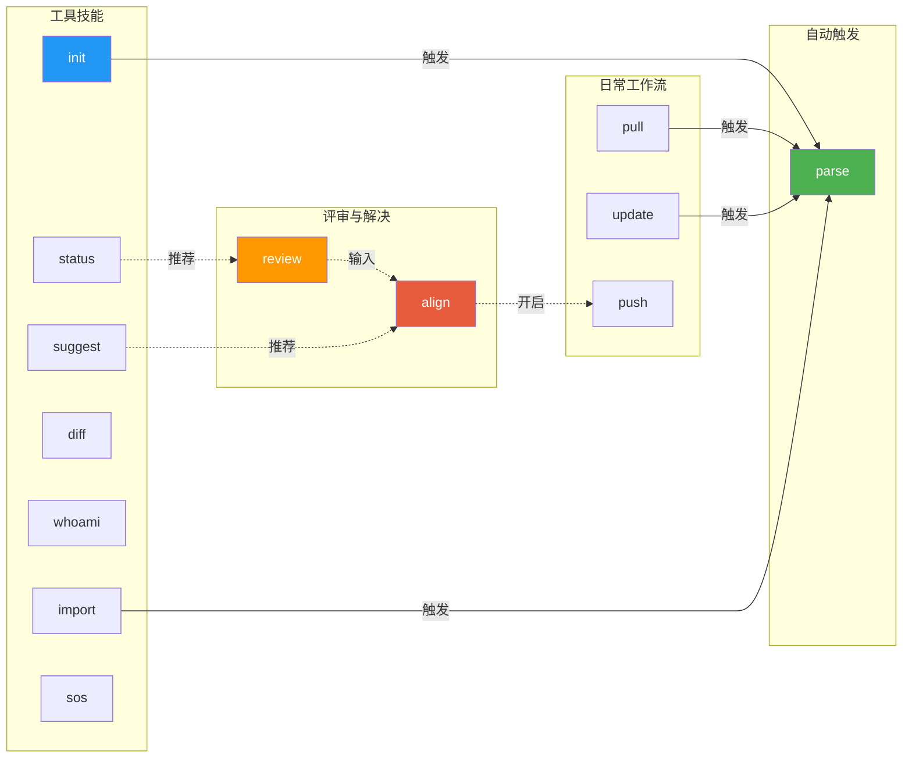

# PhoenixTeam

分布式 AI 团队文档协作插件 — 纯 Prompt，零代码，即装即用。

> English docs: [README.md](./README.md)

## 概述

PhoenixTeam 将协作实现为纯 Prompt Skill，让 AI 编码工具（Claude Code、Codex CLI）充当 "协作插件"，在多人 AI 团队中管理设计文档。所有操作通过自然语言命令触发 — AI 自动调用 Git、读写文件和解析文档。无需编写代码。

## 安装

### Claude Code — `.claude/commands/` (推荐)

```bash
git clone https://github.com/surebeli/PhoenixTeam.git /tmp/phoenix-team

# 安装到当前项目
mkdir -p .claude/commands
for skill in /tmp/phoenix-team/plugin/skills/*/SKILL.md; do
  cp "$skill" ".claude/commands/$(basename $(dirname $skill)).md"
done

# 或全局安装（适用于所有项目）
mkdir -p ~/.claude/commands
for skill in /tmp/phoenix-team/plugin/skills/*/SKILL.md; do
  cp "$skill" ~/.claude/commands/$(basename $(dirname $skill)).md
done
```

### Claude Code — `/plugin` 市场

```bash
/plugin marketplace add surebeli/PhoenixTeam
/plugin install p-team@PhoenixTeam
```

### Codex CLI

```bash
git clone https://github.com/surebeli/PhoenixTeam.git ~/.codex/skills/phoenix-team
```

### 任意 AI 工具 — 独立 Prompt 模式

将 `PHOENIXTEAM.md` 复制到项目根目录，然后告诉你的 AI 工具：

```
You are now the PhoenixTeam Plugin. Follow all rules in ./PHOENIXTEAM.md strictly.
Skill: init
```

## 快速上手

### 1 分钟 Demo（本地运行）
我们提供了一个模拟场景，让你在 1 分钟内体验 PhoenixTeam 的冲突发现与解决工作流。

```bash
# 1. 克隆仓库并安装 skills（参考上方安装指南）
git clone https://github.com/surebeli/PhoenixTeam.git
cd PhoenixTeam

# 2. 初始化并指定模拟数据目录
# 当被询问 document directories 时，输入：./tests/mock-scenarios/demo-1-conflict/alice, ./tests/mock-scenarios/demo-1-conflict/bob
/phoenix-init

# 3. 自动检测 alice (REST) 与 bob (GraphQL) 的设计分歧
/phoenix-review

# 4. 解决检测到的冲突 (例如 D-001)
/phoenix-align D-001
```

### 核心工作流

```
                        ┌─────────────────────────────────┐
                        │       首次使用（一次性）        │
                        │       /phoenix-init             │
                        │  创建 .phoenix/、绑定身份       │
                        │  写入 THESIS、归一化文档        │
                        └──────────────┬──────────────────┘
                                       │
                  ┌────────────────────────────────────────┐
                  │           日常协作循环                 │
                  │                                        │
   ┌──────────────▼───────────────┐                       │
   │ /phoenix-pull               │                       │
   │ 拉取远端 + 自动 parse        │                       │
   └──────────────┬───────────────┘                       │
                  │                                       │
   ┌──────────────▼───────────────┐                       │
   │ 编辑源文档                   │                       │
   │ (人类或 AI 修改代码/文档)    │                       │
   └──────────────┬───────────────┘                       │
                  │                                       │
   ┌──────────────▼───────────────┐                       │
   │ /phoenix-push               │                       │
   │ 同步至 .phoenix/ + 推送      │                       │
   └──────────────┬───────────────┘                       │
                  │                                       │
                  └───────────────────┬───────────────────┘
                                      │
              ┌───────────────────────▼───────────────────────┐
              │           冲突解决流程                        │
              │                                               │
              │ 1. /phoenix-review (发现分歧)                 │
              │ 2. /phoenix-align (提议/批准决策)             │
              │ 3. /phoenix-update (验证实施)                 │
              └───────────────────────────────────────────────┘
```

## 技能参考

| 命令 | 说明 |
|---------|-------------|
| `/phoenix-init` | 初始化或加入项目 |
| `/phoenix-whoami` | 检查或绑定本地身份 |
| `/phoenix-pull` | 拉取远端更改并自动解析 |
| `/phoenix-update` | 将源文档同步至 `.phoenix/` |
| `/phoenix-push` | 冲突检测后推送更改至远端 |
| `/phoenix-review` | 分析所有文档，检查与 THESIS 的分歧 |
| `/phoenix-align` | 通过 "提议 → 批准" 解决分歧 |
| `/phoenix-status` | 完整的协作状态仪表盘 |
| `/phoenix-suggest` | 基于 diff 的 AI 驱动建议 |
| `/phoenix-diff` | 查看按协作者分组的结构化 diff |
| `/phoenix-parse` | 扫描文档并更新 `INDEX.md` |
| `/phoenix-archive` | 冻结并归档设计提案 |
| `/phoenix-import` | 通过 MCP/HTTP 导入外部文档 |
| `/phoenix-sos` | 紧急自动解决 `.phoenix/` 目录下的 Git 合并冲突 |

## 技能依赖图



> **图例**: 实线箭头 = 自动触发（技能调用另一个技能）。虚线箭头 = 工作流建议。

## 协作流程

```
Alice (Claude Code)                    Bob (Codex CLI)
       │                                     │
 /phoenix-init (创始人)               /phoenix-init (加入)
 设定项目目标 → THESIS.md             评审目标 → 加入
       │                                     │
 编辑 .phoenix/design/alice/          编辑 .phoenix/design/bob/
       │                                     │
 /phoenix-push ──────→ Git ◄───────── /phoenix-push
       │                                     │
 /phoenix-pull                        /phoenix-pull
       │                                     │
       └──────────── 发现分歧 ───────────────→
                          │
                  /phoenix-review
                  分析文档 vs THESIS → 生成 D-001
                  写入 DIVERGENCES.md + 提交锚点
                          │
  ┌───────────────────────┴────────────────────┐
  │                                            │
  Alice: /phoenix-align D-001                  │
  选择方案 → 已提议 🟡                         │
  ⚠️ THESIS 尚未更新                            │
  /phoenix-push                                │
  │                                            │
  │                             Bob: /phoenix-pull
  │                             🟡 "D-001 等待您的确认"
  │                             Bob: /phoenix-align D-001
  │                             → 同意 → 已解决 ✅
  │                             生成 decisions/D-001.md
  │                             更新 THESIS 决策日志
  │                             /phoenix-push
  │                                            │
  └────────────────────────────────────────────┘
                          │
       ╔══════════════════╧══════════════════════════════════════════╗
       ║ [侧向流程] 将决策应用至源文档                                ║
       ║                                                             ║
       ║ decisions/D-001.md 包含各方的指令块                         ║
       ║ (背景 / 所需更改 / 验收标准)                                ║
       ║                                                             ║
       ║ Alice                            Bob                        ║
       ║ 阅读 decisions/D-001.md          阅读 decisions/D-001.md    ║
       ║ 传给自己的模型 →                 传给自己的模型 →           ║
       ║ 模型修改源文档                   模型修改源文档             ║
       ║      │                               │                    ║
       ║ /phoenix-update                  /phoenix-update            ║
       ║ AI 验证验收标准                  AI 验证验收标准            ║
       ║ → 通过                           → 通过                    ║
       ║      │                               │                    ║
       ║      └─────────── 全部 ✅ ────────────┘                    ║
       ║                       │                                     ║
       ║              D-001 已完全关闭 🔒                            ║
       ╚══════════════════╤══════════════════════════════════════════╝
                          │
              /phoenix-push (无待处理分歧，直接推送)
```

## 分歧处理

### 四种分歧状态

| 状态 | 含义 | 谁可以操作 |
|-------|---------|-------------|
| `open` 🔴 | 未解决 | 任何一方均可提议 |
| `proposed` 🟡 | 一方已提议，等待另一方确认 | 另一方确认/拒绝/修改；提议方可撤回 |
| `resolved` ✅ | 双方达成一致，源文档正在更新 | 各方运行 update 以完成源文档同步 |
| `fully-closed` 🔒 | 所有源文档已按决策更新 | 只读，完全归档 |

### DIVERGENCES.md — 分歧注册表

由 `review` 写入，由 `align` 读写，由 `push`/`status` 读取：

```markdown
## Open

### D-001: API 风格选择
状态: open 🔴 | 参与方: alice vs bob | 优先级: 阻塞

## Proposed

### D-002: 部署策略
状态: proposed 🟡 | 提议方: alice | 等待 bob 确认
提议决策: 采用 Kubernetes (bob 的方案) | 理由: ...

## Resolved

### D-003: 数据模型 ✅
状态: resolved | 提议方: alice | 确认方: bob
决策: 采用 NoSQL | 解决时间: 2026-04-09
更改指令: 见 .phoenix/decisions/D-003.md
```

### 提议 → 批准 两阶段确认

`align` 根据分歧状态自动切换行为：

- **分歧处于 open 状态** → 显示对比表 + AI 建议；用户选择方案 → 状态变为 `proposed`，THESIS **尚未更新**
- **分歧处于 proposed 状态，等待我确认** → 显示提议方的方案和理由：
  - ✅ 同意 → `resolved`；AI 生成各方的更改指令块（带验收标准）；更新 THESIS 决策日志
  - ❌ 拒绝（带理由） → 回退至 `open`
  - 📝 修改并反向提议 → 仍为 `proposed`，提议方变为我
- **分歧处于 proposed 状态，我是提议方** → 显示等待状态；可选择撤回提议

### decisions/ — 决策指令文件

当 `align` 确认解决后，会创建 `.phoenix/decisions/D-{N}.md`，包含：
- 完整决策 + 理由
- 各方的更改指令块：修改什么、在哪个文件、以及用于 `update` 自动验证的 **验收标准**

用户可以直接将 `decisions/D-001.md` 传递给自己的模型来执行源文档更改。

### review 提交锚点去重

`last-review.json` 记录了上次分析时各协作者的提交 hash：
- 有新提交 → 重新分析
- 无新提交 → 跳过
- `resolved` / `proposed` 状态 → 不受干扰

### pull 自动提醒

拉取后：检测是否有等待你确认的 `proposed` 分歧，以及是否有待你处理的 `resolved` 分歧。

### push 分歧软关口

推送前，区分以下情况：
- 🟡 有等待我确认的提议 → 建议先确认
- 🔴 有未解决的分歧 → 警告并等待
- 🟡 等待对方确认的提议 → 提示（非阻塞）

## 紧急状态与安全机制

### 冲突降级 (`/phoenix-sos`)

如果您在执行 `/phoenix-pull` 或 `/phoenix-push` 时遇到了 Git 树级合并冲突（即出现了 `<<<<<<< HEAD` 标记），请不要手动修改 `.phoenix/` 目录下的元数据。直接运行 `/phoenix-sos`，AI 会自动解析并智能合并冲突的分歧记录和 JSON 状态缓存。

### 试运行 (`--dry-run`)

对于具有破坏性或全局写入属性的指令，您可以附加 `--dry-run` 参数来安全预览 AI 的执行计划，这不会对文件系统造成任何实质更改：

```bash
/phoenix-review --dry-run
/phoenix-align --dry-run D-001
/phoenix-update --dry-run
```

## 生态与伴生工具

虽然 PhoenixTeam 遵循“Prompt 优先”原则，但我们提供了一些轻量级的伴生工具来增强您的工作流。

### PhoenixTeam CLI (`cli/`)

一个不包含业务逻辑的 Node.js CLI，用于辅助安装并提供本地状态面板。

- **`phoenix install`**: 自动将技能拷贝到您的 `.claude/commands` 目录。
- **`phoenix status`**: 显示 `DIVERGENCES.md` 和仓库状态的可视化汇总（零 Token 消耗）。
- **`phoenix init`**: 搭建 `.phoenix/` 目录骨架，并引导您执行 AI 的 `/phoenix-init` 提示词。
- **`phoenix sos`**: 检测 Git 树冲突并提供紧急处理指引。

### VS Code 插件 (`vscode-extension/`)

集成在 IDE 侧边栏的可视化看板。

- **侧边栏看板**: 一目了然地查看所有 `Open 🔴`、`Proposed 🟡` 和 `Resolved ✅` 的分歧。
- **快速操作**: 点击任何未解决分歧旁边的“播放”图标，即可立即打开终端并在 AI 助手中触发 `/phoenix-align`。

## 源文档同步

### 背景

`init` 执行一次性拷贝。如果此后源文档（如 `./design/spec.md`）发生变化，`.phoenix/design/{code}/` 中的副本不会自动更新。

### phoenix-update 解决方案

`update` 在 `last-sync.json` 中记录源文件 hash，每次运行时执行增量检测：

```bash
/phoenix-update           # 检测并同步所有更改
/phoenix-update --dry-run # 预览更改而不写入
/phoenix-update --force   # 跳过分歧确认，强制同步
```

### 解决后的源文档更新 (Action Items)

当 `align` 确认决策后，AI 会根据决策分析双方文档，并生成 Action Items 写入 `decisions/D-{N}.md`：

```markdown
## 源文档待办事项
| 协作者 | 源文件 | 所需更改 | 状态 |
|--------------|-------------|-----------------|--------|
| alice | ./design/api.md | 保持 REST 设计不变 | ✅ 无需更改 |
| bob | ./design/api-proposal.md | 将 GraphQL 替换为 REST，更新接口示例 | ⏳ 等待更新 |
```

各方更新源文档并运行 `update` 后，AI 会自动根据 **验收标准** 进行验证：
- ✅ 满足 → 待办事项标记为完成
- ❌ 不满足 → 给出具体指导（例如 "第 3 节仍存在 GraphQL 描述"）
- 全部完成后 → 分歧升级为 `fully-closed` 🔒

### 分支保护

`init` 会将当前分支记录为受保护的 PhoenixTeam 主分支 (`git config phoenix.main-branch`)。所有其他技能都会强制执行 **分支守护** — 拒绝在其他分支上进行操作：

```
❌ 当前分支 'feature-x' 不是 PhoenixTeam 主分支 'main'。
   请切换分支：git checkout main
```

## .phoenix/ 目录结构

初始化后在目标项目中生成：

```
.phoenix/
├── COLLABORATORS.md    # 身份映射：成员代码 → 文档目录；主分支元数据
├── THESIS.md           # 项目设计宪法 (North Star) + 决策日志
├── RULES.md            # 代码规范
├── SIGNALS.md          # 运行状态与阻塞项
├── INDEX.md            # 自动生成的文档索引
├── DIVERGENCES.md      # 分歧注册表 (D-001…状态摘要)：由 review 写入，由 align/push/status 读取
├── last-parse.json     # 解析缓存 (文件 hash)
├── last-review.json    # 评审锚点：上次评审时各方的提交 hash + 源文件 hash
├── last-sync.json      # 源文档同步状态：源文件 hash，由 update 技能维护
├── design/
│   ├── alice/          # alice 的归一化文档
│   ├── bob/
│   └── shared/         # 共同维护文档 (可选)
├── decisions/          # 分歧决策文件 (由 align 解决时创建)
│   ├── D-001.md        # 完整决策 + 各方更改指令块 + 验收标准
│   └── D-002.md
└── archive/            # 已冻结的提案
```

## 仓库结构

```
PhoenixTeam/
├── .claude-plugin/
│   ├── marketplace.json          # 市场清单
│   └── plugin.json               # Claude Code 插件定义
├── .codex-plugin/plugin.json     # Codex CLI 插件清单
├── plugin/                       # 插件核心
│   ├── skills/                   # 13 个技能 (跨平台共享)
│   │   ├── phoenix-init/
│   │   ├── phoenix-whoami/
│   │   ├── phoenix-pull/
│   │   ├── phoenix-push/
│   │   ├── phoenix-update/
│   │   ├── phoenix-parse/
│   │   ├── phoenix-status/
│   │   ├── phoenix-suggest/
│   │   ├── phoenix-diff/
│   │   ├── phoenix-review/
│   │   ├── phoenix-align/
│   │   ├── phoenix-archive/
│   │   └── phoenix-import/
│   ├── CLAUDE.md                 # 共享上下文 (Claude Code)
│   └── AGENTS.md                 # 共享上下文 (Codex CLI)
├── PHOENIXTEAM.md                # 独立 Prompt 版本 (手动模式)
├── README.md                     # 此文件 (英文)
├── README.zh-CN.md               # 中文翻译
└── docs/design/                  # 示例设计文档
```

## 许可证

MIT
